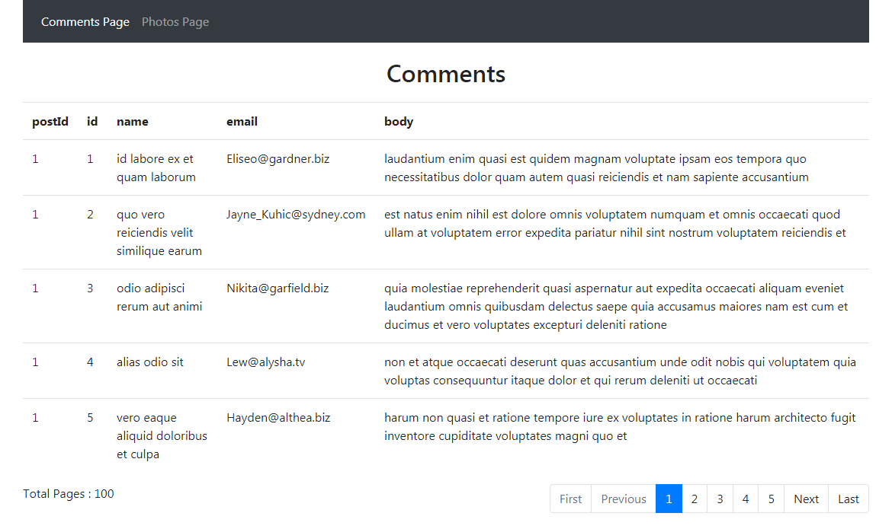

# Angular Pagination

Without using datatable, i have created this pagination with simple bootstrap table & bootstrap navigation menus.

# Run Application
```
ng serve
localhost:4200/
```



# Tutorials (For Help)

https://medium.com/angular-in-depth/top-10-ways-to-use-paginations-in-angular-db450f8a62d6
https://stackblitz.com/github/melcor76/paginations?file=src%2Fapp%2Fpaginations%2Fnotify.interptor.ts
https://embed.plnkr.co/plunk/KQ8xrl


# Pagination Inputs

1. itemsPerPage --------- How many items or data listing you want to show at a time / one page
2. initialPage --------- Starting page number
3. showPagesAtOneTime -------- How many pages you want to show at a time
4. dataLength -------- length of data items listing

# Comments Component
In Comment page, i want to display 5 pages at a time with this.showPagesAtOneTime = 5.

```
constructor(
    private apiService: ApiService,
    private cdRef: ChangeDetectorRef
  ) {
    this.itemsPerPage = 20;
    this.initialPage = 1;
    this.currentPage = 1;
    this.showPagesAtOneTime = 5;
  }
```

# Photos Component
In Comment page, i want to display 10 pages at a time with this.showPagesAtOneTime = 10.

```
constructor(
    private apiService: ApiService,
    private cdRef: ChangeDetectorRef
  ) {
    this.itemsPerPage = 20;
    this.initialPage = 1;
    this.currentPage = 1;
    this.showPagesAtOneTime = 10;
    this.getPhotosList();
  }
```  